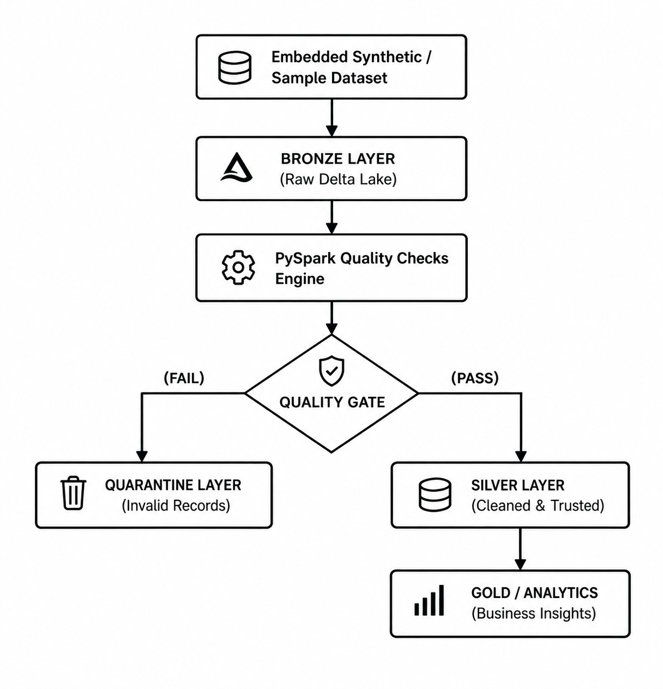

# E-Commerce Data Engineering Lakehouse

Modern Data Engineering for AI Systems — SDAIA Academy Final Project

An end-to-end Data Engineering Lakehouse pipeline for processing e-commerce transaction data using PySpark and Delta Lake. 

The project demonstrates how raw transaction data can be ingested, validated, cleaned, separated into trusted and invalid records, stored using Delta Lake, and transformed into business analytics.

---

## Project Overview

E-commerce transaction data can contain data-quality issues such as:
* Missing values
* Invalid prices
* Zero quantities
* Duplicate transactions
* Invalid transaction types
* Cancellation transactions

This project implements a controlled data engineering pipeline that identifies these issues, separates invalid records into a Quarantine layer, and stores trusted data in a Silver Delta Lake layer for downstream analytics.

---

## Project Objectives

The main objectives are to:
* Build an end-to-end data engineering pipeline.
* Ingest structured e-commerce transaction data.
* Store raw data in a Bronze Delta Lake layer.
* Apply automated data-quality validation.
* Separate failed records into a Quarantine layer.
* Transform trusted records into a Silver Delta Lake layer.
* Generate business analytics from trusted data.
* Demonstrate Delta Lake capabilities and transaction history.
* Build a reliable data foundation for future AI/ML applications.

---

## Architecture



---

## Data Engineering Pipeline

### 1. Data Ingestion
The pipeline uses PySpark to create and process the input DataFrame. 
The sample contains transaction fields such as:
* InvoiceNo
* StockCode
* Description
* Quantity
* InvoiceDate
* UnitPrice
* CustomerID
* Country

### 2. Bronze Layer
The raw input data is stored as a Delta Lake Bronze table.
The Bronze layer preserves the ingested data before trusted transformations.

`Raw Data` ➔ `Bronze Delta Lake`

### 3. Data Quality Validation
The project applies multiple data-quality checks.

**Completeness**
Checks critical fields for missing values:
* InvoiceNo
* StockCode
* Quantity
* UnitPrice
* InvoiceDate
* Country

*Note: CustomerID is not treated as a mandatory field in the main quality report because the source data can contain missing customer identifiers.*

**Validity**
The pipeline checks for:
* Null UnitPrice
* Negative UnitPrice
* Null Quantity
* Zero Quantity

**Uniqueness**
Duplicate transaction records are identified using the transaction columns.

**Business Rules**
The pipeline validates transaction behavior:
* Standard invoices should have positive quantities.
* Cancellation invoices beginning with C should have negative quantities.

---

## Quality Gate

After the quality checks, the pipeline creates a Quality Gate.

```text
       Data Quality Report
               │
               ▼
          Quality Gate
            /        \
         PASS        FAIL
          │            │
          ▼            ▼
        Silver     Quarantine


SDAIA Academy link: https://github.com/SDAIAAcademy
